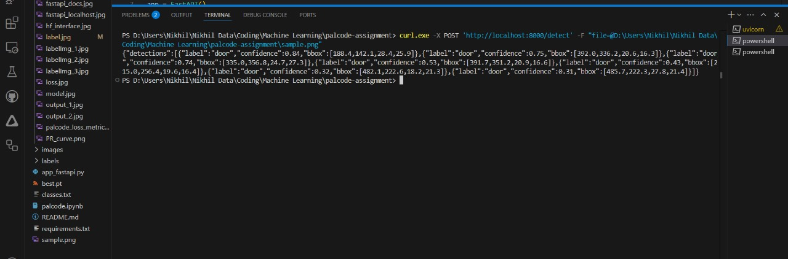

# Palcode.ai Assignment

### Door & Window Detection from Blueprints using YOLOv8

Detect `door` and `window` symbols from architectural blueprints using a custom-trained YOLOv8 model.

---

## 🚀 Options to Test

### Option 1 : Hosted on Hugging Face

- Try it directly in your browser:
  [Hugging Face App](https://huggingface.co/spaces/Nikhil-1426/palcode-object-detection)

### Option 2 : Run Locally using FastAPI

1. Clone the repo and install requirements:
    ```bash
    git clone https://github.com/Nikhil-1426/palcode.ai-assignment.git
    cd "palcode.ai-assignment"
    pip install -r requirements.txt
    ```

2. Run FastAPI server:
    ```bash
    uvicorn app:app --host 0.0.0.0 --port 8000 --reload
    ```

3. Send an Image to the /detect Endpoint
    ```
    curl -X POST http://localhost:8000/detect -F "file=@<path_to_image>"
    ```
    Replace <path_to_image> with the actual path to your image file.
    
    For example:
    ```
    curl -X POST http://localhost:8000/detect -F "file=@C:/Users/YourName/sample.png"
    ```
    
    If you're using PowerShell or Windows with paths that contain spaces, wrap the file path in double quotes:
    
    ```
    curl.exe -X POST "http://localhost:8000/detect" -F "file=@\"C:\Path With Spaces\image.png\""
    ```
---

## 📦 Project Structure

- `images/` – Input blueprints
- `labels/` – YOLO format label files
- `classes.txt` – Class list (`door`, `window`)
- `app_fastapi.py` – FastAPI inference code
- `best.pt` – Trained model
- `assets/` – Evidence: labeling, training, inference
- `README.md` – You're reading it

---

## 📸 Screenshots

| Task | Screenshot |
|------|------------|
| Labeling |  |
| Training Console |    |
| Visualisation |    |
| Deployment |    |
| Curl Request |  |

---

## 🎓 How it Works

1. Labeled blueprint symbols manually with LabelImg
2. Trained YOLOv8 model from scratch (no pre-annotated data)
3. Created an API for detection
4. Deployed to Hugging Face for visual testing
5. Also available locally via FastAPI with `curl` support

---

## 📤 Final Submission Includes

- GitHub repo (this)
- Public API link (Hugging Face)
- `.zip` with label files + trained model
- Loom video demonstration

---

## 🎥 Demonstration Video

[Watch the walkthrough](https://www.loom.com/share/your-video-id)

---

Submission by Nikhil Parkar
